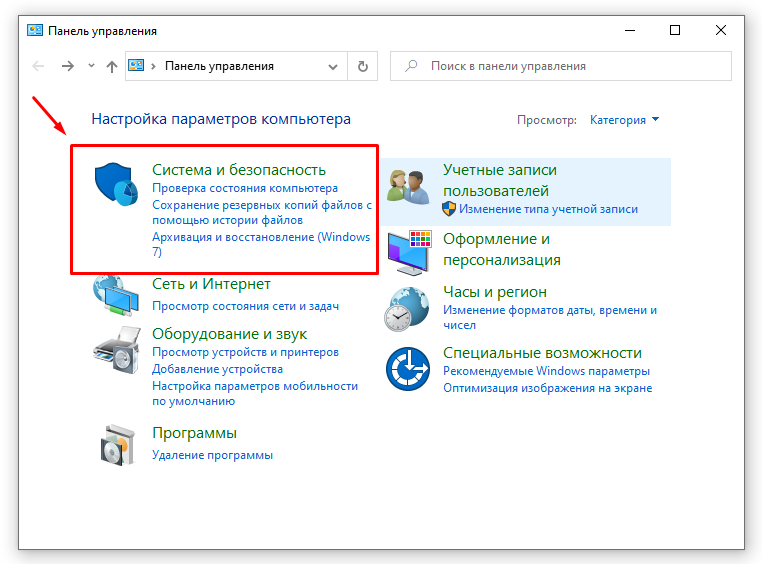
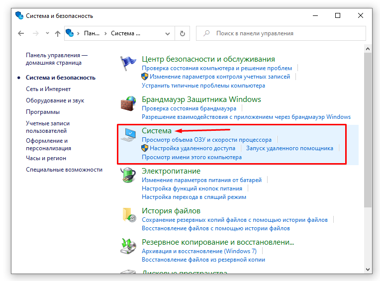
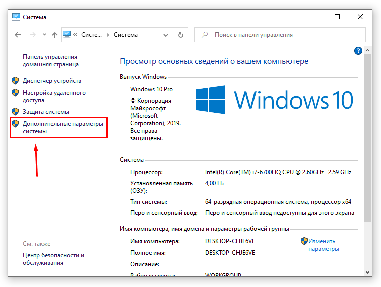
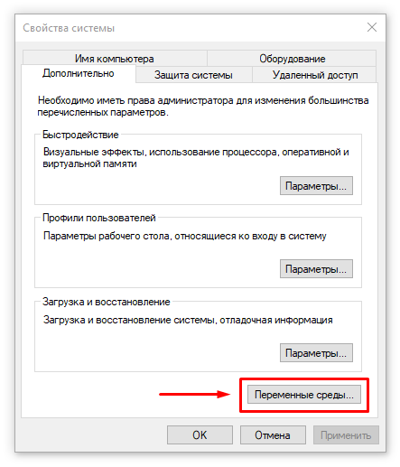
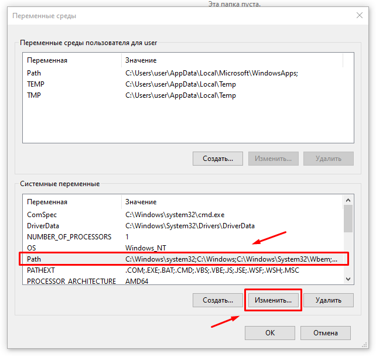
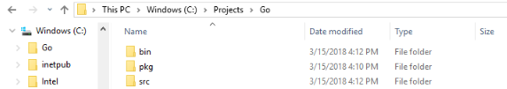
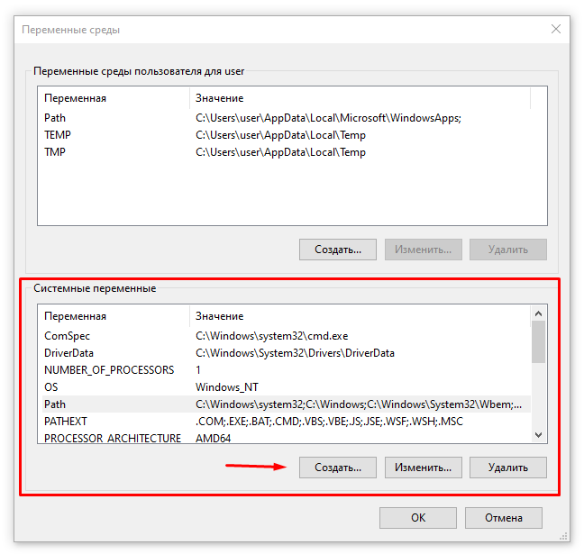
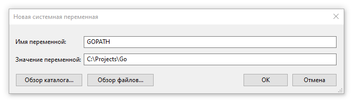

Язык Go был создан компанией Google как open source проект и является комплируемым статически типизированным языком программирования. Язык может служить для разработки различных приложений, но в основном язык используется для backend приложений. Также Go является кроссплатформенным, можно создавать программы на раличных ОС: Windows, Mac OS, Linux, FreeBSD. Код с легкостью можно переносить из одной ОС на другую, т.к. обладает переносимостью

Начало разработки языка началось в 2007 году Кеном Томпсоном, который является одином из авторов языка C. Язык был анонсирован 10 ноября 2009 года и в 2012 уже появилась версия 1.0, но разарботка ведётся и по сей день. Последней версией языка в 2022 году является 1.18.

Основные особенности языка Go:

* компилируемый - компилятор транслирует программу на Go в машинный код, понятный для определенной платформы

* статически типизированный

* присутствует сборщик мусора, который автоматически очищает память

* поддержка работы с сетевыми протоколами

* поддержка многопоточности и параллельного программирования

Известные компании, которые используют язык Go для своих проектов: Google, Dropbox, Netflix, Kubernetes, Docker, Twitch, Uber, CloudFlare

Установка Golang 

Windows:

Установка элементов в правильном порядке
1. Так как зачастую Go использует бесплатные репозитории с открытым исходным кодом, сначала установить пакет Git
2. Перейдите на сайт инсталляции Go. Скачайте и установите последний 64-битный набор Go для Microsoft Windows OS;
3. Следуйте инструкциям по установке программы Go;
4. Откройте командную строку cmd и наберите go version;
5. Вывод после ввода go version должен вывести скаченную вами версию;

Создание рабочего пространства Go

Для начала подтвердим работоспособность Go. Откройте Панель Управления, затем следуйте в Система и безопасность > Система > Дополнительные параметры системы. Кликните на Переменные Среды с правой нижней стороны. Убедитесь, что у Path в Системные Переменные есть значение C:\Go\bin.











Затем нужно создать рабочее пространство Go. Оно будет в отдельной новой папке от той, где сохранены и установлены файлы Go. К примеру, ваши установленные файлы Go могут находиться по пути C:\Go, а создать рабочее пространство Go можно по адресу C:\Projects\Go.



Создание переменной среды GOPATH
Создадим переменную GOPATH и свяжем ее с недавно созданным рабочим пространством Go. Перейдите обратно в Панель Управления, затем в Система и потом на Переменные среды. Затем под Системные Переменные нажмите на Создать.



Рядом с Имя переменной введите GOPATH, а рядом с Значение переменной введите C:\Projects\Go:



Проверить, установлены ли пути верно можно через ввод echo %GOPATH% в командной строке.

Linux:

1. Перейдите на страницу https://golang.org/dl/ и загрузите последнюю версию.

```
$ cd ~/Downloads
$ wget -c https://storage.googleapis.com/golang/go1.8.4.linux-amd64.tar.gz
```
2. Затем проверьте целостность архива, проверив контрольную сумму SHA256 архивного файла, используя команду shasum, как показано ниже, где флаг -a используется для указания алгоритма, который будет использоваться:

```
$ shasum -a 256 go1.7.3.linux-amd64.tar.gz
hash go1.7.4.linux-amd64.tar.gz
```