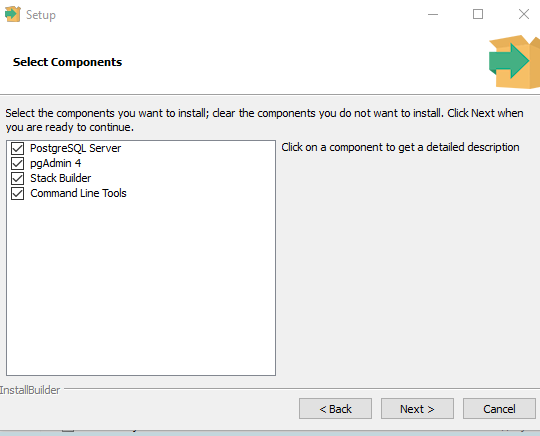
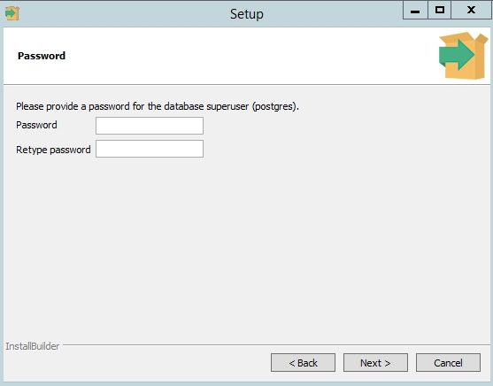
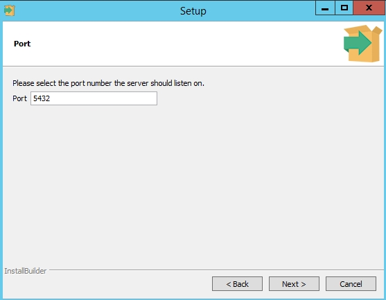

На большинствах платформах Linux `PostgreSQL` уже установлен в систему. Чтобы установить его на Windows, нужно перейти на оффициальный сайт и выбрать версию для скачивания.

В процессе установки установите галочки на пунктах:

* PostgreSQL Server – сам сервер СУБД
* PgAdmin 4 – визуальный редактор SQL
* Stack Builder – дополнительные инструменты для разработки (возможно вам они понадобятся в будущем)
* Command Line Tools – инструменты командной строки



Установите пароль для пользователя postgres (он создается по умолчанию и имеет права суперпользователя).



По умолчание СУБД слушает на порту 5432, который нужно будет добавить в исключения в правилах фаерволла.



Управлять базой можно через командую строку, нужно перейти в директорию с бинарными файлами выполнив на Windows следующую команду.

```powershell
CD C:\Program Files\PostgreSQL\11\bin
```

На линукс можно просто ввести `psql`

Основные команды PostgreSQL:

* Проверка установленной версии СУБД: `psql –V`
* Для создания новой базы данных воспользуйтесь утилитой `createdb: createdb -U postgres testdb` (где postgres суперпользователь, testdb новая база данных)Введите пароль суперпользователя.
* Проверить список активных баз: `psql -U postgres –l` (пароль)
* С помощью инструмента createuser cоздадим нового пользователя: `createuser –U postgres operator` (где operator -имя нового пользователя)
* Предоставим пользователю привилегии суперпользователя (на практике этого делать не надо). Запустите интерактивную командную оболочку управления PostgreSQL (shell): `psql –U postgres` . С помощью SQL команды `ALTER ROLE` предоставим нужные права нашему пользователю: `ALTER ROLE` operator `SUPERUSER CREATEROLE CREATEDB`; . Мы предоставили пользователю права суперпользователя, права на создание ролей и баз данных.
* Для выводы списка пользователей и ролей в СУБД выполните команду: `\du`
* Для вывода таблиц в СУБД выполните команду: `\dt`

Давайте создадим таблицу users в нашей бд:

```SQL
CREATE TABLE table_name (
    column_name1 col_type (field_length) column_constraints,
    column_name2 col_type (field_length),
    column_name3 col_type (field_length)
);
```


```sql
CREATE TABLE users (
    id serial PRIMARY KEY,
    name varchar (50) NOT NULL,
    location varchar(25) check (location in ('north', 'south', 'west', 'east', 'northeast', 'southeast', 'southwest', 'northwest')),
    ip inet NOT NULL
);
```

Добавим запись:

```sql
INSERT INTO users (name, location, ip) VALUES ('Ilya', 'west', '185.16.230.99');
INSERT INTO users (name, location, ip) VALUES ('Ivan', 'west', '187.17.237.97');
```

Мы можем просмотреть добавленные данные следующей командой:

```sql
SELECT * FROM users;
```

Или просмотреть только определенные поля например ip:

```sql
SELECT ip FROM users;
```

Также можно посмотреть определенные данные:

```sql
SELECT ip FROM users where name = 'Ilya';
```

Или дать органичение на количество:

```sql
SELECT ip FROM users where location = 'west' limit 1;
```

А теперь удалим запись:

```sql
DELETE FROM users WHERE name = 'Ilya';
```

Добавим столбец:

```sql
ALTER TABLE users ADD browser varchar(50);
```

И уберем:

```sql
ALTER TABLE users DROP location;
```

Обновим данные в таблице:

```sql
UPDATE users SET browser = 'Mozilla FireFox' WHERE name = 'Ilya';
UPDATE users SET browser = 'Chrome' WHERE name = 'Ivan';
```