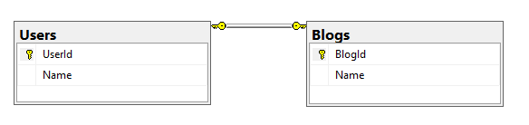
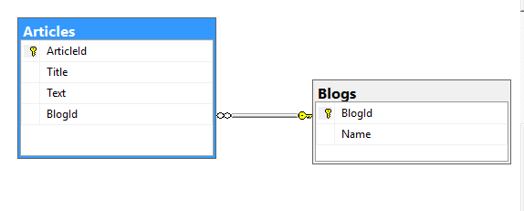
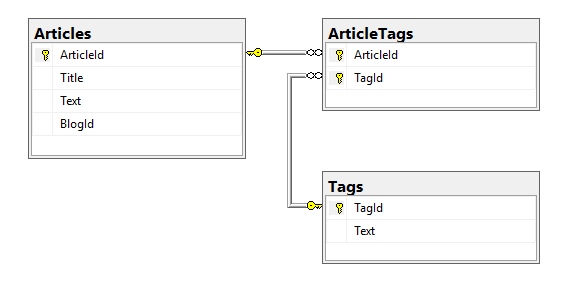

ORM или Объектно-реляционное отоброжение - это технология в программирование, которое служит прослойкой между базой данных и кодом. Она позволяет вместо нативных `sql` комманд писать их в стиле языка программирования, и также использовать структуры как объекты из бд.

Премущества в использовании в `ORM`.

* для реализации одинакового функционала требуется написать меньше кода;
* не нужно писать SQL запросы;
* не нужно самому создавать объекты;
* легко сопровождать

Недостаток использования `ORM` связан с со сниженной скоросью работы с БД. Из-за большого слоя абстракций, выполняются много преобразований, что будет замедлять работы и также влиять на память, поэтому для работы с большим количеством данных лучше использовать нативный `SQL`.

Для языка программирования `Go`, есть множество `ORM`, но в этом курсе мы будем работать с `Gorm`.

Установка:

```bash
go get -u gorm.io/gorm
```

Это достаточно хорошая и дружелюбная библиотека, которая поддерживает такие субд как: `MySQL`, `PostgreSQL`, `SQL Server`, `Clickhouse`. Но также если, некоторые бд не попали в этот список, но имеют схожий диалект как у `MySQL` или `PostgreSQL`, то можно просто использовать диалект этих баз данных.

Обзор:

* Полнофункциональный ORM
* Связи (Has One (имеет одну), Has Many (имеет много), Belongs To (принадлежит) Many To Many (многие ко многим), Polymorphism (полиморфизм), Single-table inheritance (одно табличное представление))
* Хуки (До/После Создать/Сохранить/Обновить/Удалить/Найти)
* Нетерпеливая загрузка с помощью Preload, Joins
* Транзакции, вложенные транзакции, точки сохранения, откат к сохраненной точке
* Context, Prepared Statement Mode, DryRun Mode
* Batch Insert, FindInBatches, Find/Create with Map, CRUD with SQL Expr and Context Valuer
* SQL Builder, Upsert, Locking, Optimizer/Index/Comment Hints, Named Argument, SubQuery
* Композитный первичный ключ, Индексы, Зависимости
* Автомиграция
* Logger
* Расширяемый плагин API: Резолвер Баз данных (Множество БД, Разделение чтения/записи) / Prometheus…
* Каждая функция поставляется с тестами
* Дружественная для разработчиков

`Gorm` также позволяет делать чистые SQL запросы с помощью `Scan`, чтобы после выполнения прочитать результат. Или команды `Exec`, которая выполнится без возврата результата.

При проектирование важно придерживаться 4 формальны правил:

1) отношение один к одному:
Разбиение одной большой таблицы на несколько маленьких. Основная родительская таблица в этом случае продолжает содержать часто используемые данные, а дочерняя зависимая таблица обычно хранит данные, которые используются реже.
Например, таблица Users представляет пользователей и имеет следующие столбцы:
* `UserId` (идентификатор, первичный ключ)
* `Name` (имя пользователя)
* И таблица `Blogs` представляет блоги пользователей и имеет следующие столбцы:
`BlogId` (идентификатор, первичный и внешний ключ)Name (название блога)
* В этом случае столбец `BlogId` будет хранить значение из столбца `UserId` из таблицы пользователей. То есть столбец `BlogId` будет выступать одновременно первичным и внешним ключом.

2) отношение один ко многим:
В этом типе связей несколько строк из дочерний таблицы зависят от одной строки в родительской таблице.
К примеру, пусть будет таблица Articles, которая представляет статьи блога и которая имеет следующие столбцы:
* `ArticleId` (идентификатор, первичный ключ)
* `BlogId` (внешний ключ)
* `Title` (название статьи)
* `Text` (текст статьи)
* В этом случае столбец `BlogId` из таблицы статей будет хранить значение из столбца `BlogId` из таблицы блогов.

3) отношение многие к одному:
Эту связь можно рассмотреть зеркально к приведенной выше связи один ко многим. Иными словами, отношение сущности «дети» к сущности «родители», где обязательная связь будет при условии, что у ребенка есть хотя бы один родитель. Если же участвуют все дети, в том числе и находящиеся в детских домах, отношение будет с необязательной связью.
4) отношение многие ко многим:
При этом типе связей одна строка из таблицы А может быть связана с множеством строк из таблицы В. В свою очередь одна строка из таблицы В может быть связана с множеством строк из таблицы А.
Например, в случае со статьями и тегами пусть будет таблица Tags, которая имеет два столбца:
* TagId (идентификатор, первичный ключ)
* Text (текст тега)
Также пусть будет промежуточная таблица ArticleTags со следующими полями:
* TagId (идентификатор, первичный и внешний ключ)
* ArticleIdId (идентификатор, первичный и внешний ключ)


Также важно придерживаться нормальных форм:
Нормальная форма — требование, предъявляемое к структуре таблиц в теории реляционных баз данных для устранения из базы избыточных функциональных зависимостей между атрибутами (полями таблиц).

https://habr.com/ru/post/254773/ статья по этой теме