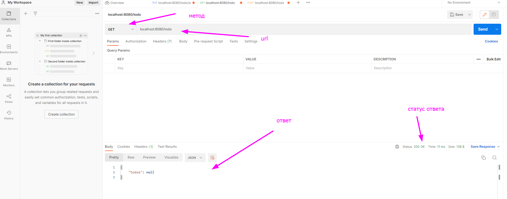
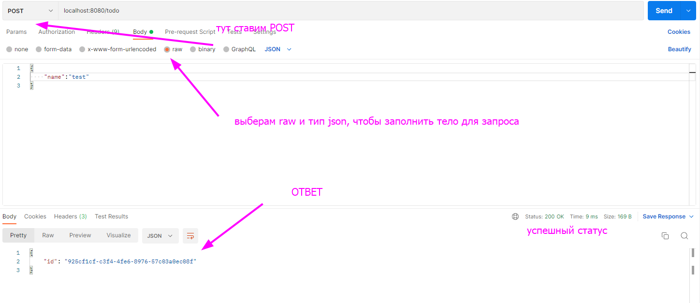
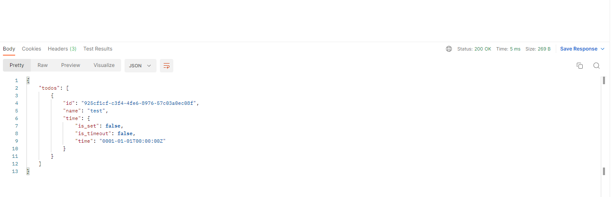

Для того, чтобы поработать с API, скачайте и запустите когда то мной написанный сервер как тестовое задание для одной американской компании, цель которого заключалось в создание API для TODO листа с таймером.

После скачивания перейдите в директорию проекта и пропишите в консоль:

```bash
go run cmd/main.go
```

Также для более удобной работы с API, советую скачать замечательную программу Postman https://www.postman.com/downloads/?utm_source=postman-home.

После скачивания перейдите в рабочее пространство и создайте запрос вот так



В овтете null потому что нет данных, давайте что то добавим с помощью метода POST



Теперь есть данные, давайте попробуем сделать GET запрос заново



Ответ успешен, попробуйте сами выставить таймер по url `localhost:8080/todo/settimeout` используя метод `PUT` и проверить его истичение срока. Он принимает body такого формата:
```json
{
    "id": "6b4ce489-1928-4a16-8838-b3c78dd29fe8",
    "timer": 5
}
``` 