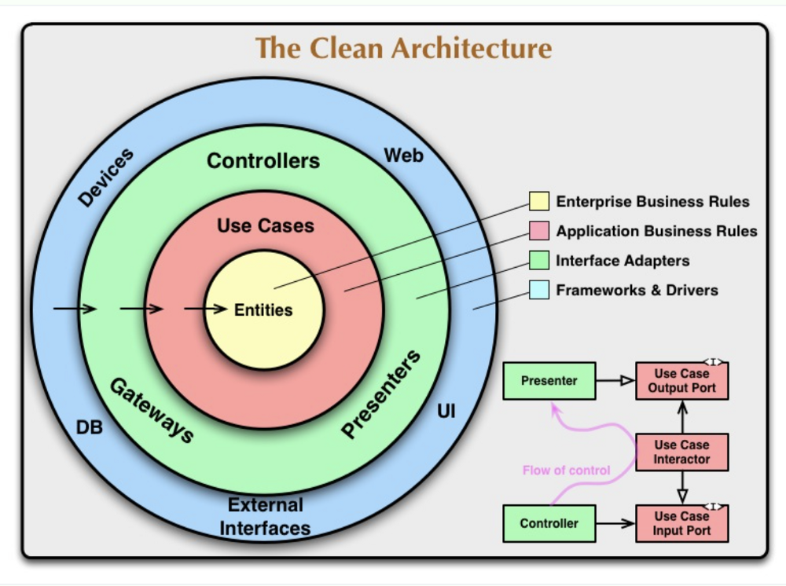

В большинсве backend приложений на Go используют шаблон проекта основанный на чистой архитектуре.

Поговорим немного о ней

Чистая архитектура — это одна из программных разработок для организации кодовой базы, которая обеспечивает решение этих проблем, с которыми вы когда-либо сталкивались. Внедрив чистую архитектуру, вы получите:

* независмость от пользовательского интерфейса, веб-фреймворка или базы данных
* фокус на бизнес логике
* легкую тестируемость
* ремонтопригодный, очивидный и простой для понимания

В чистой архитектуре кодовая база должна быть гибкой и портативной. Она не должна зависеть от какого-то фреймворка или базы данных, что означает, что вы можете поменять её на совершенно новую платформу.

1. Зависимости могут указывать только внутрь
В чистой архитектуре такие детали, как веб-инфраструктура и базы данных, находятся во внешних слоях, в то время как важные бизнес-правила находятся во внутренних кругах и ничего не знают о внешнем мире. Следуя принципу ациклических зависимостей (ADP), зависимости указывают только внутрь круга,
не указывают наружу и не обращаются.

Принцип ациклических зависимостей (ADP) — это принцип проектирования программного обеспечения, определенный Робертом С. Мартином, который гласит, что «граф зависимостей пакетов или компонентов не должен иметь циклов». Это означает, что зависимости образуют ориентированный ациклический граф.

2. Разделение деталей и абстракций
Детали в чистой архитектуре — это данные, структура, база данных и API. Использование деталей на основном уровне означает нарушение правила зависимости. Он всегда должен зависеть от абстрактного интерфейса, а не от конкретных знаний о деталях, поэтому он будет гибким и удобным в обслуживании.
Как видно в правой части диаграммы, она показывает, что контроллер и презентер зависят от входного порта варианта использования и выходного порта, который определяется как интерфейс, а не конкретная логика (детали). Но как можно работать, не зная деталей внешнего слоя?

*Entities* (Сущности)
Сущности — это модель предметной области, которая имеет широкие бизнес-правила и может представлять собой набор структур данных и функций. Например тип структуры пользователя, книги и автора.

*Use cases* (Сценарии использования)
Варианты использования содержат бизнес-правила приложения, использующие модель предметной области, и имеют порт ввода и порт вывода.
Входной порт отвечает за обработку данных внешнего уровня и определен как абстрактный.
Выходной порт отвечает за обработку данных из вариантов использования на внешний уровень и определяется как абстрактный.

*Interface adapter* (Адаптер интерфейса)
Адаптер интерфейса обеспечивает связь с внутренним и внешним уровнями. Он заботится только о технологической логике, не бизнес-логика.

Contrlollers (Контроллеры) — это набор конкретной реализации входного порта в вариантах использования. Например преобразование данных формы перед сохранением их в базе данных.
Presenter — это набор конкретной реализации порта вывода в вариантах использования.Например преобразование данных из базы данных перед передачей в представление

Фреймворки и драйверы
Фреймворки и драйверы содержат такие инструменты, как базы данных, фреймворки или API.

О организации директорий приложения можно ознакомиться тут:
https://github.com/golang-standards/project-layout/blob/master/README_ru.md